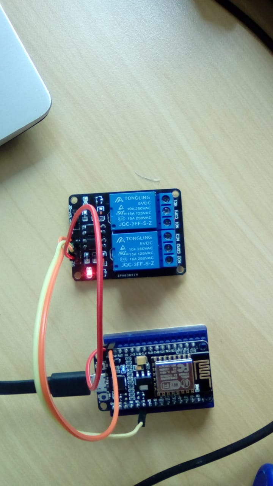
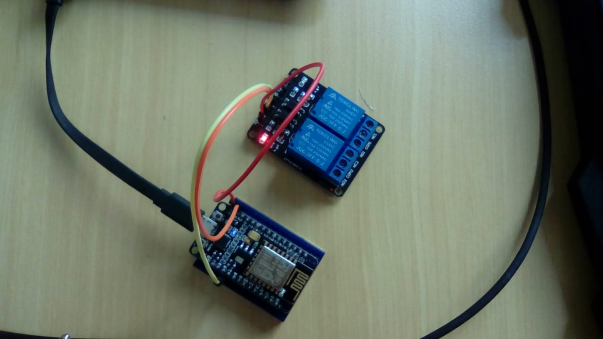
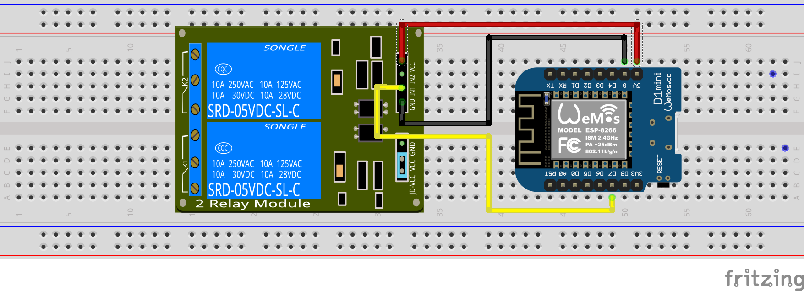
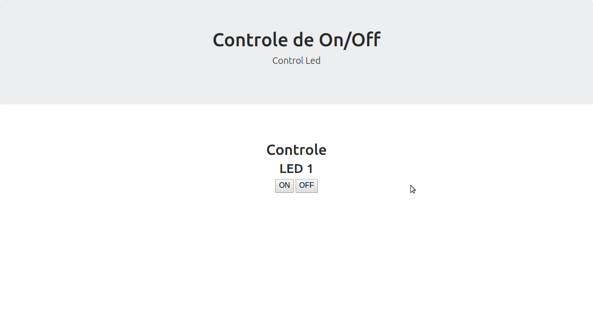

# Projet Acender um Led 
### Exercicio Grupo de Pesquisa de Internet das Coisas UTFPR TD

Projeto de controle de Led usando flask

### Requisitos Minimos de sistema

* Paho.mqtt
* Flask
 

### Instalação das bibliotecas

$ pip install paho-mqtt
$ pip install flask

### How to use ? 
PS: Abra 2 terminais

 
```shell
terminal-1 $ git clone https://github.com/juanengml/ProjetLed.git
terminal-1 $ cd v2/
terminal-1@v2 $ python app.py 
```


Crie sua conta no https://ngrok.com/
siga os passos para autenticação, depois com seu ngrok autenticado abra o segundo terminal
```shell
terminal-2 $ ./ngrok http 8080 
```
Espere ele gerar seu link simular a esse


### Como funciona ? 

O script acima basicamente fará 3 coisas: se conectar à rede wifi, se conectar ao broker e ficará na escuta por eventos de publish.

Toda vez que que uma mensagem for publicada e o tópico for /led/ o esp estará escutando por este tópico, logicamente quando receber a mensagem, o mesmo irá tratar e efetuar a regra de negócio, que no nosso caso como se trata de uma base , será apenas acionar um led ou algo qualquer conectado ao shield rele por exemplo.


### Eletronica no nodemcu e no Raspberry 
#### 1 - Passo: vc conecta seu modulo rele no nodemcu 






#### 2 - Passo: conecte seu raspberry na mesma rede que seu nodemcu 


#### 3 - Hacking Happy ! 


